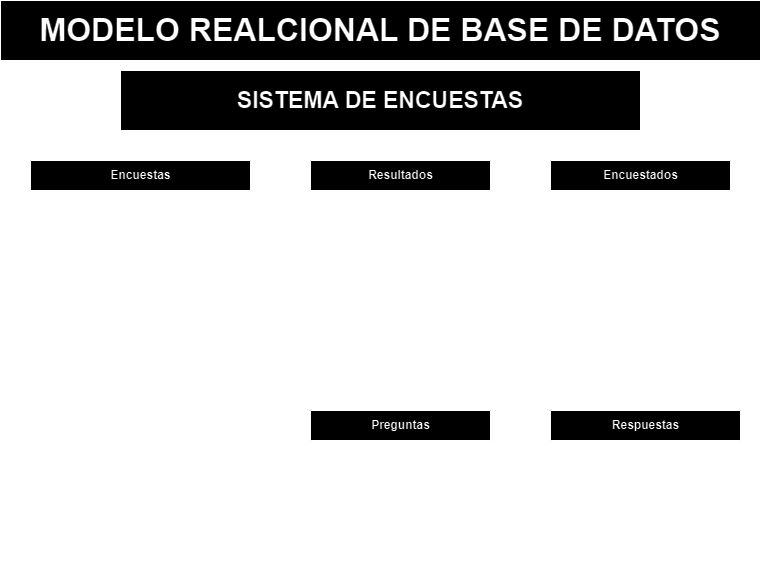

# Encuestas

## Listado de Entidades

### encuestas **(ED)**

- encuesta_id **(PK)**
- nombre
- descripcion
- imagen
- fecha
- encuestados

### preguntas **(ED)**

- pregunta_id **(PK)**
- encuesta_id **(FK)**
- pregunta

### respuestas **(ED)**

- respuesta_id **(PK)**
- pregunta_id **(FK)**
- respuesta
- es_correcta

### encuestados **(ED)**

- ecuestado_id **(PK)**
- nombre
- apellidos
- edad
- email **(UK)**

### resultados **(ED|EP)**

- resultado_id **(PK)**
- encuesta_id **(FK)**
- encuestado_id **(FK)**
- preguntas
- correctas

## Relaciones

Una **Encuesta** tiene muchas **preguntas** (_1 a M_).
Una **Pregunta** tiene muchas **respuestas** (_1 a M_).
Una **encuesta** tiene muchos **resultados** (_1 a M_).
Un **encuestado** tiene muchos **resultados** (_1 a M_).

## Diagramas

### Modelo Relacional de la DB

### Corrida de datos

## Reglas de negocio

### Encuestas
 1. Crear una encuesta.
 1. Leer toda las encuestas.
 1. Leer una encuesta en particular.
 1. Actualizar una encuesta
 1. Eliminar una encuesta
 1. Aumentar en 1 el valor del atributo _encuestados_ cada que un encuestado complete la encuesta.

### Preguntas

1. Crear una pregunta.
1. Leer toda las preguntas.
1. Leer una pregunta en particular
1. Actualizar una pregunta.
1. Eliminar una pregunta

### Respuestas

1. Crear una respuesta.
1. Leer todas las respuestas.
1. Leer una respuesta en particular.
1. Actualizar una respuesta.
1. Eliminar una respuesta.

### Encuestados

1. Crear un encuestado.
1. Leer todos los encuestados.
1. Leer a un encuestado en particular.
1. Actualizar a un encuestado.
1. Eliminar a un encuestado.
1. Antes de crear un encuestado en la entidad, verificar mediante su email que no exista

### Resultados

1. Crear un resultado.
1. Leer todo los resultados.
1. Leer un resultado en particular.
1. Actualizar un resultado.
1. Eliminar un resultado.
1. Sacar el porcentaje de asertividad que tuvo el encuestado