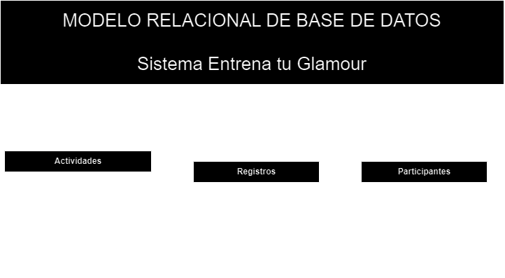

# Entrena Tu Glamour

## Requisitos del sistema

- Registrar participantes para el evento  Entrena tu _Glamour_.
- El evento tendrá cuatro disciplinas: _KickBoxing_, Pilates, Yoga y Zumba.
- Cada disciplina tendrá 3 bloques de horarios:
    - bloque 1 de 9:00 a 12:00
    - bloque 2 de 14.00 a 17:00
    - bloque 3 de 18:00 a 21:00
- Cada actividad tendrá  un máximo de 10 participantes, excepto Yoga que tendrá 20.
- Cada participante sólo se podrá registrar a una sóla actividad.

## Listado de entidades

### Actividades **(EC)**

- actividad_id **(PK)**
- bloque
- disciplina
- horario
- cupo

| actividad_id | bloque   | disciplina  | horario       | cupo |
| ------------ | -------- | ----------- | ------------- | ---- |
| 1K           | Bloque 1 | KICK BOXING | 9:00 a 12:00  | 10   |
| 1Y           | Bloque 1 | YOGA        | 9:00 a 12:00  | 20   |
| 1P           | Bloque 1 | PILATES     | 9:00 a 12:00  | 10   |
| 1Z           | Bloque 1 | ZUMBA       | 9:00 a 12:00  | 10   |
| 2K           | Bloque 2 | KICK BOXING | 14:00 a 17:00 | 10   |
| 2Y           | Bloque 2 | YOGA        | 14:00 a 17:00 | 20   |
| 2P           | Bloque 2 | PILATES     | 14:00 a 17:00 | 10   |
| 2Z           | Bloque 2 | ZUMBA       | 14:00 a 17:00 | 10   |
| 3K           | Bloque 3 | KICK BOXING | 18:00 a 21:00 | 10   |
| 3Y           | Bloque 3 | YOGA        | 18:00 a 21:00 | 20   |
| 3P           | Bloque 3 | PILATES     | 18:00 a 21:00 | 10   |
| 3Z           | Bloque 3 | ZUMBA       | 18:00 a 21:00 | 10   |

### Participantes **(ED)**

- email **(PK)**
- nombre
- apellido
- nacimiento

### Registros **(ED | EP)**

- registro_id **(PK)**
- email **(FK)**
- actividad_id **(FK)**
- fecha

## Relaciones

1. Una Actividad pertenece a varios registros (_1 a M_).
1. Un participante solo se puede registrar a una actividad (_1 a 1_).

## Diagrama Modelo Relacional de la DB.

## Reglas de Negocio

### Actividades

1. Crear una actividad.
1. Leer todas las actividades.
1. Leer una actividad en particular.
1. Actualizar una actividad.
1. Eliminar una actividad.

### Participantes

1. Crear un participante.
1. Leer todos los participantes.
1. Leer un participante en particular.
1. Actualizar un participante.
1. Eliminar un participante.

### Registros

1. Crear un registro.
1. Leer todos los registros.
1. Leer un registro en particular.
1. Eliminar un registro.

### Lógica y validaciones de requisitos

- Registrar un participante implica:
    - Validar cupo de la actividad.
    - Insertar datos a las entidades participantes y registros.
    - Restarle uno al atributo cupo de la entidad actividades.
- Listar registros.
- Eliminar participante implica:
    - Eliminar datos a las entidades participantes y registros.
    - Sumarle uno al atributo cupo de la entidad actividades.

