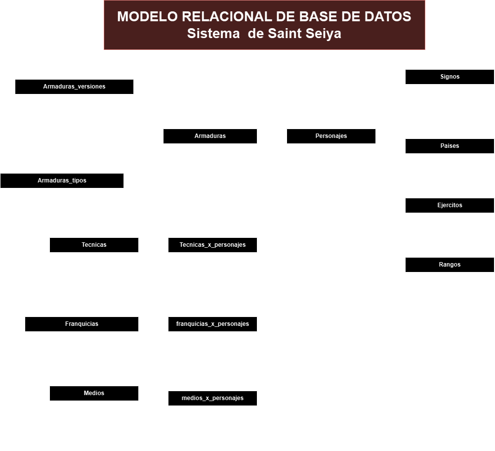

# Sait Seiya

## Listado de entidades

### Personajes **(ED)**

- personaje_id **(PK)**
- nombre
<!-- - armadura **(FK)** -->
- signo_id **(FK)**
- nacimiento
- pais **(FK)**
- entrenamiento **(FK)** (va hacer referencia a la entidad pais 😯)
- maestro **(FK)** (llave foranea de la misma entidad, es como una llave recursiva)
- ejercito **(FK)**
- rango **(FK)**
- foto
- canonico (es escrito y avalado por el autor de la manga {original})

### armaduras **(ED | EC)**

- armadura_id **(PK)**
- armadura
- personaje_id **(FK)**
- armadura_tipo **(FK)**

### armaduras_tipos **(EC)**

- armadura_tipo_id **(PK)**
- armadura_tipo

### armaduras_versiones **(EC | EP)**

- armadura_version_id **(PK)**
- armadura_id **(FK)**
- version
- foto

### signos **(EC)**

- signo_id **(PK)** 
- signo

### paises **(EC)**

- pais_id **(PK)** 
- pais

### ejercitos **(EC)**

- ejercito_id **(PK)** 
- ejercito

### rangos **(EC)**

- rango_id **(PK)** 
- rango

### Tecnicas **(EC)** (va ser una relación de M a M)

- tecnica_id **(PK)** 
- tecnica

### tecnicas_x_personajes **(EP)**

- txp_id **(PK)**
- personaje_id **(FK)**
- tecnica_id **(FK)**

### franquicias **(EC)**

- franquicia_id **(PK)**
- franquicia

### franquicias_x_personajes **(EP)**

- fxp_id **(PK)**
- personaje_id **(FK)**
- franquicia_id **(FK)**

### medios **(EC)** {anime, película, manga, videojuego}

- medio_id **(PK)**
- medio (manga, ánime, videojuego, películas, series)

### medios_x_personajes **(EP)**

- mxp_id **(PK)**
- personaje_id **(FK)**
- medio_id **(FK)**

## Relaciones

1. Un **personaje** tiene muchas **armaduras** (_1 a M_). 
1. **armadura** tiene un **tipo de armadura** (_M a 1_).
1. Una **"Armadura"** tiene muchas **versiones** (1 a M).
1. Un **signo** pertenece a muchos **personajes** (_1 a M_).
1. Un **pais** pertenece a muchos **personajes** (_1 a M_).
1. Un **personaje** entrenó en un **pais** (_1 a M_)
1. Un **personaje** tiene muchos **maestros** (_1 a M_)
1. **ejercito** tiene muchos **personajes** (_1 a M_).
1. **rango** pertenece a muchos **personajes**(_1 a M_).
1. Un **personaje** tiene muchas **técnicas** y **técnica** puede ser usada por muchos **personajes** (_M a M_). [usamos una tabla pivote]
1. **personaje** tiene muchas **franquicias** y **franquicias** tiene muchos **personajes** (_M a M_).
1. **personajes** pertenece a **medios** y **medios** pertenece a muchos **personajes** (_M a M_).

## Diagrama Modelo Relacional de la BD

## Reglas de Negocio

### Personajes

1. Crear un personaje.
1. Leer todo los personajes.
1. Leer un personaje en particular.
1. Actualizar un personaje.
1. Eliminar un personaje.

### Armaduras

1. Crear una armadura.
1. Leer todas las armaduras.
1. Leer una armadura en particular.
1. Actualizar una armadura.
1. Eliminar una armadura.

### Armadura_Tipos

1. Crear un tipo de armadura.
1. Leer todo los tipos de armadura.
1. Leer un tipo de armadura en particular.
1. Actualizar un tipo de armadura.
1. Eliminar un tipo de armadura.

### Armadura_Versiones

1. Crear una version de armadura.
1. Leer todas las verciones de armadura.
1. Leer una version de armadura en particular.
1. Actualizar una armadura_version.
1. eliminar una version de armadura.

### Signos

1. Crear un signo.
1. Leer todo los signos.
1. Leer un signo en particular.
1. Actualizar un signo.
1. Eliminar un signo.

### Paises

1. Crear un pais.
1. Leer todo los paises.
1. Leer un  pais en particular.
1. Actualizar un pais.
1. Eliminar un pais.

### Ejercitos

1. Crear un ejercito.
1. Leer todo los ejercitos.
1. Leer un ejercito en particular.
1. Actualizar un ejercito.
1. Eliminar un ejercito.

### Rangos

1. Crear un rango.
1. Leer todo los rangos.
1. Leer un rango en particular.
1. Actualizar un rango.
1. Eliminar un rango.

### Tecnicas

1. Crear una tecnica.
1. Leer toda las tecnicas.
1. Leer una tecnica en particular.
1. Actualizar una tecnica.
1. Eliminar una tecnica.
 
### tecnicas_x_personajes (es una entidad pivote, no tiene sentido actualizarlas) 

1. Crear tecnicas_x_personajes.
1. Leer todas las tecnicas_x_personajes .
1. eliminar una tecnicas_x_personajes.

### Franquicias

1. Crear una franquicia.
1. Leer toda las franquicias.
1. Leer una franquicia en particular.
1. Actualizar una franquicia.
1. Eliminar una franquicia.
 
### franquicias_x_personajes

1. Crear franquicias_x_personajes.
1. Leer toda las franquicias_x_personajes.
1. eliminar una franquicias_x_personajes.

### medios

1. Crear medios.
1. Leer todo los medios.
1. Leer un medio en particular.
1. Actualizar un Medio.
1. Eliminar una medio.

### medios_x_personajes

1. Crear medios_x_personajes.
1. Leer todo los medios_x_personajes.
1. eliminar un medios_x_personajes.

