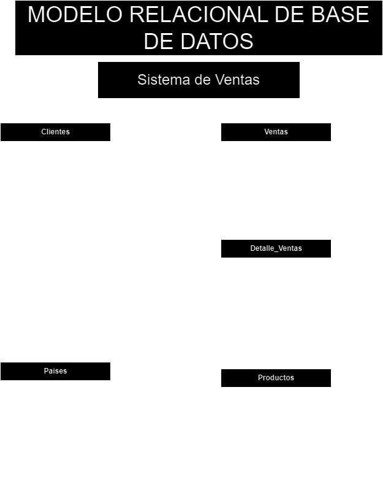

# VENTAS

## Listado de entidades

### Clientes  **(ED) entidad de datos**
- cliente_id **PK**
- nombre
- apellidos
- telefono **(UQ)**
- email **(UQ)**
- dirección
- municipio
- ciudad
- pais_id **(FK)** 

### Productos  **(ED/|EC)**
- producto_id **PK**
- nombre
- descripcion
- foto
- precio
- stock  _me refiero al stock_

### Ventas **(ED)**
- venta_id **(PK)**
- fecha 
- monto
- cliente_id **(FK)**

### Detalle_ventas **(EP)**
- detalle_id **(PK)**
- cantidad
- precio_unitario
- venta_id **(FK)**
- producto_id **(FK)**

### Paises **(Entidad Catálogo EC)**

- pais_id **(PK)**
- nombre
- dominio **(UQ)**

> si tu vendes ropa tendrás que agregar 'tallas' entonces si vendes otros productos tendras que identificar sus atributos.

## Relaciones   

> Miremos siempre desde la perspectiva del cliente y no desde la perspectiva del pais.

1. Un **cliente** pertenece a un **pais** (_1 a 1_)
1. Un **cliente** genera muchas **ventas**  (_1 a m_)
1. Una **venta** tiene **detalle_ventas** (_1 a m_)
1. un **detalle_venta** es un **produto** (_1 a 1_)
1. 
1. 

### MODELO RELACIONAL DE LA BASE DE DATOS: SISTEMA DE VENTAS

PAISES

| PaisID | Nombre           | Dominio  |
|--------|-------------------|----------|
| 1      | Bolivia           | .bo      |
| 2      | Argentina         | .ar      |
| 3      | Brasil            | .br      |
| 4      | Chile             | .cl      |
| 5      | Colombia          | .co      |
| 6      | Perú              | .pe      |
| 7      | México            | .mx      |
| 8      | España            | .es      |
| 9      | Estados Unidos    | .us      |
| 10     | Canadá            | .ca      |
| 11     | Francia           | .fr      |
| 12     | Alemania          | .de      |
| 13     | Italia            | .it      |
| 14     | Japón             | .jp      |
| 15     | Corea del Sur     | .kr      |
| 16     | India             | .in      |
| 17     | China             | .cn      |
| 18     | Rusia             | .ru      |
| 19     | Sudáfrica         | .za      |
| 20     | Australia         | .au      |

CLIENTES

| ClienteID | Nombre         | Apellidos         | Telefono     | Email                        | Direccion                    | Municipio     | Departamento | PaisID |
|-----------|----------------|-------------------|--------------|----------------------        |-------------------------     |---------------|--------------|--------|
| 1         | Juan           | Pérez             | 601234567    | juan.perez@gmail.com         | Av. 16 de Julio 123          | Viacha        | La Paz       | 1      |
| 2         | María          | Sánchez           | 602345678    | maria.sanchez@yahoo.com      | C. Los Andes 456             | El Alto       | La Paz       | 1      |
| 3         | Carlos         | Fernández         | 603456789    | carlos.fernandez@hotmail.com | Av. Ballivián 789            | La Paz        | La Paz       | 1      |
| 4         | Ana            | Rodríguez         | 604567890    | ana.rodriguez@outlook.com    | C. Juan de la Riva 101       | El Alto       | La Paz       | 1      |
| 5         | Luis           | García            | 605678901    | luis.garcia@gmail.com        | C. Murillo 202               | Viacha        | La Paz       | 1      |

PRODUCTOS

| ProductoID | Nombre                      | Descripcion                                         | Foto                  | Precio  | Stock |
|------------|-----------------------------|---------------------------------------------------  |---------------------- |---------|-------|
| 1          | Parlante Bluetooth          | Parlante portátil con sonido HD                     | img/parlante01.jpg    | 79.99   | 25    |
| 2          | Sistema de Audio            | Sistema de sonido envolvente 5.1                    | img/audio01.jpg       | 299.99  | 10    |
| 3          | Auriculares Inalámbricos    | Auriculares con cancelación de ruido                | img/auricular01.jpg   | 159.99  | 50    |
| 4          | Subwoofer                   | Subwoofer de 12 pulgadas                            | img/subwoofer01.jpg   | 199.99  | 15    |
| 5          | Barra de Sonido             | Barra de sonido para TV con Bluetooth               | img/barra01.jpg       | 129.99  | 20    |
| 6          | Receptor AV                 | Receptor de audio y video con Bluetooth y Wi-Fi     | img/receptor01.jpg    | 349.99  | 8     |
| 7          | Micrófono Inalámbrico       | Micrófono inalámbrico para karaoke y presentaciones | img/microfono01.jpg   | 99.99   | 30    |
| 8          | Amplificador de Sonido      | Amplificador para equipos de sonido                 | img/amplificador01.jpg| 249.99  | 12    |
| 9          | Ecualizador                 | Ecualizador de sonido de 10 bandas                  | img/ecualizador01.jpg | 119.99  | 18    |
| 10         | Cables de Audio             | Set de cables de audio RCA y HDMI                   | img/cables01.jpg      | 29.99   | 100   |

VENTAS

| VentaID | Fecha       | Monto  | ClienteID |
|---------|-------------|--------|-----------|
| 1       | 2024-01-15  | 79.99  | 1         |
| 2       | 2024-02-20  | 599.98 | 2         |
| 3       | 2024-03-12  | 159.99 | 3         |
| 4       | 2024-04-25  | 199.99 | 4         |
| 5       | 2024-05-30  | 129.99 | 5         |
| 6       | 2024-06-10  | 349.99 | 2         |
| 7       | 2024-07-18  | 89.97  | 1         |
| 8       | 2024-08-22  | 199.98 | 4         |
| 9       | 2024-09-05  | 249.99 | 3         |
| 10      | 2024-10-12  | 119.99 | 5         |

DETALLE VENTAS

| DetalleID | Cantidad | PrecioUnitario | VentaID | ProductoID |
|-----------|----------|----------------|---------|------------|
| 1         | 1        | 79.99          | 1       | 1          |
| 2         | 2        | 299.99         | 2       | 2          |
| 3         | 1        | 159.99         | 3       | 3          |
| 4         | 1        | 199.99         | 4       | 4          |
| 5         | 1        | 129.99         | 5       | 5          |
| 6         | 1        | 349.99         | 6       | 6          |
| 7         | 3        | 29.99          | 7       | 10         |
| 8         | 2        | 99.99          | 8       | 7          |
| 9         | 1        | 249.99         | 9       | 8          |
| 10        | 1        | 119.99         | 10      | 9          |

### REGLAS DE NEGOCIO

### Clientes
1. Crea un cliente.
1. leer todos los clientes.
1. Leer a un cliente en particular.
1. actualizar un cliente.
1. Eliminar a un cliente.

### Productos

1. Crea un producto.
1. leer todos los productos.
1. Leer a un producto en particular.
1. actualizar un producto
1. Eliminar a un producto.
1. Cada vez que se realice una venta, debes restar la cantidad vendida del producto del inventario disponible (stock) correspondiente a ese producto.

### Ventas
1. Crea una venta.
1. leer todas las ventas.
1. Leer una venta en particular.
1. Leer el monto total de compras de un cliente.
1. Leer toda las ventas de un producto.
1. actualizar una venta.
1. Eliminar una venta.

> nos puede servir para aplicar un cupon de descuento.
> nos puede servir para saber que producto se vende más o cual deja mejores ganancias.

### Detalle venta

1. Crear un detalle.
1. leer todo los detalles.
1. Leer un detalle en particular.
1. Leer todo los detalles de una venta.
1. Leer todo los detalles asociados un producto.
1. Leer todo los detalles asociados a un cliente.
1. Actualizar un detalle.
1. Eliminar un detalle

### Paises
1. Crear un país.
1. Leer todo los paises.
1. Leer un país en particuar.
1. Actualizar un país.
1. Eliminar un país.