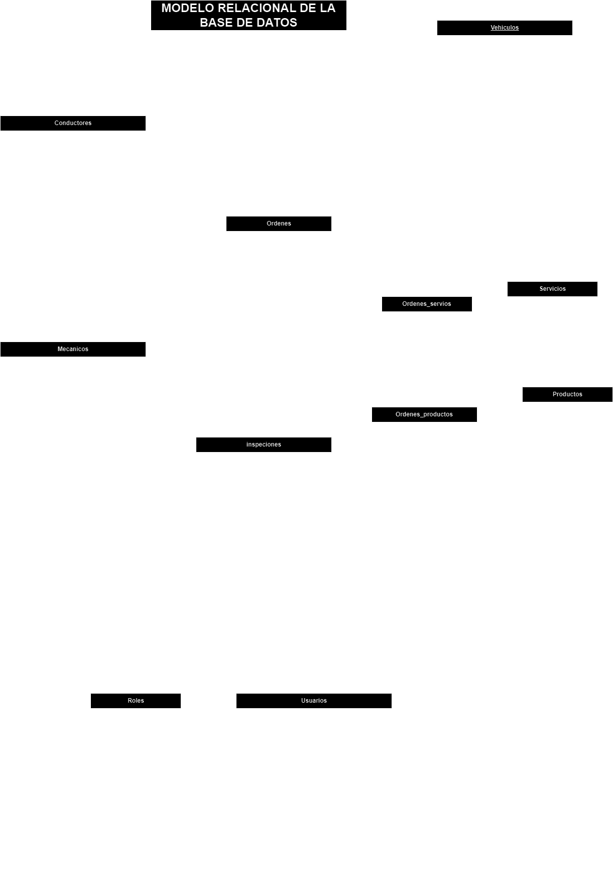

# Diseño de Bases de Datos

## Conceptos Básicos

El mundo moderno está centrado en la información y los datos "Big Data" la Ia(alaliza toda la información que está en la base de datos y nos responde según a eso) 

Hay 2 conceptos que debemos entender 쮺uál es la diferencia entre `datos` e `información`?

**Dato**
> _es la minima unidad de información(por si solo, no tiene un valor intrínseco)_ ej 38 (significa muchas cosas)

**Información**

> _Es un conjunto de datos que nos va a generar conocimiento_ eje: Mi nombre es ALLIE Y TENGO 29 AÑOS.

en tonces la informacion ya tiene un contexto.

**쯈ué es una Base de datos?**

Es una colección de información organizada en un sistema(una pequeña libreta o cuaderno) antes la contabilidad se llenaba en libros contables ahora se a automatizado con Google sheet, excel y demás.

La tecnologia que nos va permitir organizar los datos y representar la información esencial para un sistema de información se va denominar: Sistema Gestor de Base de Datos **`SGBD/DBMS`**(es un software que nos va permitir encapsular datos) y nos va permitir almacenarlo, recuperarlo, de editarlo, de conservarlo, de eliminarlos, etc.

por lo tanto un **`SGBD/DBMS`** nos va permitir gestionar la información de una base de datos de forma digital.

nos ofrece:

1. optimizacion para almacenar grandes cantidades de información.
1. mayor seguridad y una administración eficiente
1. manipulacion de la información de manera concurrente.
1. Garantiza la integridad de los datos.

A el Sistema Gestor de Base de Datos **`SGBD/DBMS`** lo podemos clasificar en dos:

- Sistemas gestores Relacionales(SQL).
- Sistemas gestores No Relacionales(NoSQL).

La mala elección de la base de datos puede darnos una larga lista de problemas durante el desarrollo de nuestras aplicaciones.

## Tipos de Base de Datos.

**Relacionales(SQL)** se organizan en un conjunto de tablas(filas y columnas) y se organizan a travez de identificadores la cual va establecer la relación entre otras tablas que forman parte de la base de datos. al hacer una consulta, demanda cierto procesamiento dependiendo de la complejidad del _query_
>- MySQL
>- MariaDB
>- Postgres
>- SqlServer
>- Oracle

**No Relacionales(NoSQL)** Están diseñadas para modelar datos con estructuras más especificas y que no necesiten ser relacionados unos datos con otros. Cada entidad va funcionar de forma independiente. Es muy utilizado en el Big Data para sus análisis. Al no tener una estructura definida como las _relacionales_ se puede tener incluso redundancia de datos. no tardan mucho en responder. Los formatos que se utilizan es el de un documento(objeto organizado en claves y valores) que es muy parecido a Json.

>- Bases de datos documentales.
>- llave valor que trabajan con Graphos
>- MongoDB
>- Redis
>- Apache Casandra
>- Firebase
>- FireStore.

mira que hay un documento por cada registro de la base de datos.

## 쮺uándo usar SQL y cuándo NoSQL? 

Dependerá del tipo de aplicación que querremos realizar.

si quires desarollar una aplicación de tipo contable(inventario de productos, información de clientes) usa el tipo **relacional(SQL)**, en esta aplicación habrá más de una tabla que tenga relación con el resto. entonces una base de datos relacional será más util y podrá representar de una mejor forma los datos de nuestra aplicación.

> Lo usaremos cuando necesitemos relaciones estructuradas, datos estructurados

Si nuestra aplicación necesita de un sistema que las tablas no se relacionen unos con otros y ademas no tenemos la serteza de que todo los datos tenga la misma estructura usamos un tipo **no relacional(NoSQL)**  eje: (estadisticas de comportamiento de un usuario al visitar a un sitio, base de datos para recolectar sus datos biométricos, galeria de fotos en Fb e Ig) esta dinámica puede cambiar de pendiendo sus dinámicas con el sitio. El objetivo es almacenar y volver a mostrar en el momento que se requiera.

> lo usaremos cuando un aspecto importante sea la escalabilidad, datos no estructurados(unas van a tener más campos que otras) ron rapidas.

쮺uál es la principal diferencia entre base de datos SQL Y NoSQL?
Es su estructura en como almacenan los datos SQL utiliza una estructura organizada y relacional, las NoSQL utilizan una estructura más flexible y escalable.

##  Entidades y Atributos

**Entidad** es un objeto del mundo real (persona, cueta, servicio, factura) es un objeto del cual nosotros vamos a almacenar una información, y al ser objetos tiene caracteristicas que las describen y a esas propiedades es lo que se les llama **atributos** de la entidad.

> lo primero que debemos hacer al diseñar la base de datos es hacer un listado de las entidades y sus atributos.

### Tipos de entidades

* De Datos 
* Catálogos
* Pivotes

las **_entidades de datos_** almacenan la información en el sistema eje: nombre, apellido, dirección, telefono, correo.

las **_entidades llamadas catálogos_**, la información ya debe estar precapturada, va ver campos donde jalemos ese listado del catálogo eje: en el sistema de estudiantes podemos clasificar a las personas como: personal administrativo, profesores, Estudiante. Otro ejemplo seria cuando estamos llenando un formulario nos muestre el país, generalmente en la Iu nos muestra una lista de la cual nosotros elegimos la opción, otro ejemplo seria los _códigos postales_

[enlace paises](https://gist.github.com/brenes/1095110)

Las **_entidades Pivote_** nos van a permitir hacer relación entre dos o más entidades tambien llamadas e_ntidades de enlace o entidades de asociación_

### Tipos de datos (atributos)

Los atributos al final se convierten en los tipos de datos que podemos almacenar.

* números enteros y flotantes
* Cadenas y caractéres de texto.
* Fechas y horas. 
* Booleans. 
* Blobs y archivos.
* Datos Geográficos.

Ejemplo de datos  m = masculino, f = femenino, nb = no binario

Es inportantisimo guardar el momento de una transación, el momento que insertas, eliminas, actualizas algún dato para tener referencia de cuando se hizo.

Ejemplo de Booleans: usuario activo o desactivo

Blobs y archivos sirve para almacenar imágenes videos y audios **en la medida de lo que puedan no inyecten archivos binarios a una base de datos** por que para recuperar esa información demanda mucho poder de computo a la base de datos y por ende al servidor donde esté. 

> lo ideal es almacenar los archivos en SAN(_storage area network_)

por ejemplo en un servicio de nube como podria ser:dropbox, google Drive, One drive.
Entonces cuando necesites la foto o el archivo y lo que vas a guardar en el campo como referencia a la base de datos es una cadena de texto con la url que hace referencia a donde vas a encontrar el archivo.

Tambien se pueden guardar datos de geolocalización sobre todo modelos orientados a graphos.

Dependiendo de el gestor de bases de datos, puede haber muchas variantes respectos a los tipos de datos (te ofrecen una gran gama de datos), y estos son solo algunos ejemplos de los tipos de datos que se pueden almacenar y manejar en una base de datos. El tipo de datos que utilices depende de las necesidades específicas de la aplicación y de la naturaleza de los datos.

## CRUD

**CRUD** Es un acrónimo(puede ser leida como cualquier otra palabra) se refiere a las 4 operaciónes básicas que se pueden realizar en una base de datos: **_crea(create), leer(read), actualizar(update), y eliminar(delete)_**

Estas operaciones se considera la funcionalidad básica que se espera de cualquier sistema de gestión de bases de datos, y suelen estar implementadas de manera nativa en la mayoría de los _SGBD_.

Estas operaciones se utilizan tanto en la administración de objetos y privilegios de la base de datos como en la gestión de los datos mismos.

## Lógica de Negocio.

La lógica de negocios es el conjunto de reglas, políticas y procesos que describen cómo se lleva a cabo el negocio.

En el modelado de una base de datos, la lógica de negocios se refiere a la representación de las reglas y procesos de negocios en el modelo de datos.
Estas reglas y procesos incluyen cosas como la validación de los datos, la validación de las restricciones de negocios, la definición de las relaciones entre las entidades, y la definición de cómo se deben calcular ciertos valores.

La incorporación de la lógica en el modelo de datos permite asegurar que los datos estén correctos y validados y respetar las restricciones que requiere el negocio antes de que la información se almacene en nuestra base de datos.

permite a los desarroladores entender como es que se relacionan y se utilizan en el sistema los datos, utiles en el mantenimiento o implementación del modelo.

La logica de negocio puede ser reutilizada en diferentes partes de la aplicación, reduce el esfuerzo para implementar la misma lógica en múltiples lugares.

> la parte más importante en una base de datos es su conceptualización y su modelo, para evitar el retrabajo.

## Llaves.

Hace único a un registro de información. 
Tenemos 2 tipos:

### Llaves Primarias (PK)

Identifica un registro como único dentro de la entidad a la que pertenece. en el listado de atributos vamos a poner las siglas **PK** de **Primary Key** delante del atributo que sea llave principal. 

쯈ué podria ser una llave principal?

* ci (ya que es un número único para cada paersona)
* Registro Universitaro.

### Llaves Foraneas

Relaciona los datos de un registro de una entidad con las de otra, o con un registro distinto de la misma entidad. En nuestro listado de atributos pondremos las siglas **FK** de **Foreign Key** delante del atributo que sea llave foránea.

> EJEMPLO: hablando de los roles que podriamos tener en ese sistema de gestion escolar podria yo tener estudiantes, profesores y personal administrativo, entonces estos perfiles van a tener una llave, en la entidad que almacena las personas en lugar de ver el nombre de: _estudiantes, profesores y personal administrativo_ vamos a ver el Id(identificador) al que hace referencia,

### Atributos únicos.

En algunas ocaciones vamos a necesitar atributos únicos que no haya datos duplicados en la entidad, pero no son necesariamente una llave primaria o foranea.

> **Ejemplo** para que un usuario no pueda crear 2 cuentas diferentes con un mismo **correo o número de teléfono**(muy comun cuando queremos darnos de alta en las redes sociales). Otro ejemplo seria el alias o el nombre de usuario que utilizas, los números de las placas de los vehiculos, nuestra CI, etc. Podrian ser consideradas Atributo único

## Relaciones

Las relaciones son las asociaciones que hacemos entre las entidades para poder recuperar y vincular los datos.

Para crear una relación semántica utilizamos un **verbo** para relaciónar las entidades en cuestión.

### Tipos de relaciones:

* **1 a 1** cada Automobil tiene una única placa y cada placa pertenece a un único automobil.
* **1 a M** una escuela puede tener muchos estudiantes, pero cada estudiante solo puede estar inscrito en una escuela específica.
* **M a M** Un estudiante puede inscribirse en muchos cursos. y un curso puede tener muchos estudiantes inscritos. 
>> Para manejar esta relación, normalmente se utiliza una tabla intermedia (también llamada tabla de unión o tabla de relación) que contiene las claves primarias de ambas tablas. Esto permite que cada estudiante pueda estar asociado con varios cursos y cada curso pueda tener varios estudiantes. (**tabla estudiantes, tabla cursos, tabla inscripciones**)

>> no es muy comun(puede significar que lo tengas que volver a normalizar o usar el no relacional) pero lo puedes encontrar en estos casos, por ejemplo, en sistemas de gestión educativa, bibliotecas, o redes sociales.

## Modelo Entidad relación.

- **Modelo entidad-relación (MER)**: Se refiere al concepto teórico y abstracto que describe cómo las entidades (objetos o conceptos) y sus relaciones se estructuran en un sistema de base de datos. Es una representación conceptual que define las reglas y restricciones de los datos.

- **Diagrama entidad-relación (DER)**: Se caracteriza por utilizar una serie de símbolos y reglas para representar los datos y sus relaciones. Con este modelo conseguimos representar de manera gráfica la estructura lógica de una base de datos.

> En resumen, el **modelo** es la teoría y el **diagrama** es la visualización de esa teoría.

* Las entidades se representan con rectángulos.
* Los atributos se representan con óvalos que se conectan a la entidad a la que pertenecen.
* Los atributos que son llaves primarias se subrayan.
* Las relaciones se representan con rombos que conectan a las entidades relacionadas, dentro del rombo se coloca el verbo que hace la relación entre las entidades.

쯈uien va determinar la lógica de negocio? las personas encargadas de cada biblioteca.

Hay una variante a este diagrama, que se llama **Modelo Relacional de la Base de Datos** que también ejemplifica gráficamente la relación de las entidades y la descripción de los atributos de estas.

Personalmente prefiero este tipo de diagrama por sobre el modelo entidad-relación, ya que nos permite describir el tipo de dato de cada atributo y se vuelve más fácil de manejar al tener cada entidad en una tabla con sus respectivos atributos.

> dos palitos en intersectan se considera "uno" y la patita de gallo representa "muchos"

Este tipo de diagramas lo puedes hacer con cualquier aplicación o software de diseño o diagramación, yo uso [draw.io](https://www.drawio.com/) que es gratuita.

> una entidad en SQL relacional se convierte en Tablas, y una entidad en NoSql se convierte en Documento

seria bueno tener información precargada de los catálogos.

## Normalización de BD's

La normalización de bases de datos es un proceso que se utiliza para organizar y optimizar la estructura de una base de datos para asegurar su integridad, evitar la redundancia y mejorar el rendimiento. La normalización consiste en la división de las entidades en varias entidades más pequeñas y relacionarlas mediante llaves foráneas.

La normalización se realiza a través de varios niveles o formas, cada uno de los cuales representa un grado de descomposición de la entidad original. Los tres niveles más comunes de normalización son la Primera Forma Normal _(1FN)_, la Segunda Forma Normal _(2FN)_ y la Tercera Forma Normal _(3FN)_, aunque existen otros 2 niveles.

El objetivo de la normalización es reducir la redundancia y garantizar la integridad de los datos al asegurar que cada dato solo se almacene en un solo lugar y que los datos sean consistentes y coherentes. La normalización también ayuda a mejorar el rendimiento de la base de datos, ya que reduce el tamaño y la complejidad de las entidades, lo que facilita la indexación y la búsqueda de información.

Es importante tener en cuenta que la normalización puede tener un impacto en el rendimiento de la aplicación, ya que puede requerir una mayor cantidad de consultas y una complejidad adicional para recuperar y manipular datos. Por lo tanto, es importante encontrar un equilibrio entre la normalización y la eficiencia en el diseño de la base de datos.

> tener muchas tablas pero tablas pequeñitas, si tu tienes una entidad muy grande es más complejo hacer operaciones sobre ellas.

### Formas normales

Las formas normales son estándares para la organización y modelamiento de datos en una base de datos relacional. En total existen 5 formas normales.

1. **Primera Forma Normal (1FN):** Cada atributo de una entidad debe contener solo valores atómicos, es decir, valores indivisibles que no pueden ser divididos en atributos más pequeños.
1. **Segunda Forma Normal (2FN):** Además de cumplir con la _1FN_, cada atributo no dependiente funcionalmente de la llave principal debe estar en una entidad separada.
1. **Tercera Forma Normal (3FN):** Además de cumplir con la _2FN_, todas las dependencias funcionales deben ser eliminadas, es decir, no deben existir dependencias funcionales transitorias.
1. **Cuarta Forma Normal (4FN):** También llamada de Forma Normal de _Boyce-Codd (FNBC)_, es una forma más restrictiva que la 3FN, donde se garantiza que no existan dependencias funcionales parciales o transitivas en la entidad.
1. **Quinta Forma Normal (5FN):** También conocida como Forma Normal de _Domino-Clave (FNDC)_, en ella se debe garantizar que no haya dependencias múltiples de conjuntos en las entidades.

> si tienes un indicativo de que estás normalizando hasta la 5ta forma, puede ser un sintoma de que no estas llevando correctamente el modelado 

Al aplicar las formas normales a un modelo de base de datos, se puede asegurar que los datos sean consistentes, que no haya redundancia y que sea fácil de mantener y escalar.

Sin embargo, también es importante tener en cuenta que la aplicación de formas normales más rigurosas puede resultar en una estructura de base de datos más compleja y menos eficiente en términos de rendimiento. Por lo tanto, es importante encontrar un equilibrio entre la integridad de los datos y la eficiencia en el diseño de un modelo de base de datos.

--- 

1. **Primera Forma Normal:** En la _1FN_, cada columna de una tabla debe contener únicamente valores atómicos, es decir, valores simples que no pueden ser divididos en partes más pequeñas.
1. **Segunda Forma Normal:** La _2FN_ requiere que cada columna no dependiente funcionalmente de la clave primaria de una tabla sea movida a una tabla separada. Esto significa que cada tabla debe representar un solo hecho o concepto.
1. **Tercera Forma Normal:** La _3FN_ requiere que todas las dependencias funcionales sean removidas de la tabla, es decir, que no haya redundancia de información.
1. **Forma Normal de Boyce**-Codd: La _FNBC_ es una forma normal más rigurosa que la anteriores y requiere que cada dependencia funcional sea una clave candidata única.
1. **Forma Normal de Dominio-Clave:** Esta forma normal (FNDC) es una extensiones de la _FNBC_ y se utiliza para asegurar la integridad de los datos en modelos de datos más complejos. No debe haber dependencias funcionales múltiples, es decir, una dependencia funcional en la que varios atributos dependen de una clave externa.

segun Copilot

¡Claro! Aquí tienes una explicación sencilla de las tres primeras formas normales al diseñar una base de datos:

1. **Primera Forma Normal (1NF)**:
   - **Regla**: Cada columna debe contener solo valores atómicos (indivisibles) y cada registro debe ser único.
   - **Ejemplo**: Si tienes una tabla de estudiantes, cada celda debe contener solo un valor, como un solo número de teléfono por celda.

2. **Segunda Forma Normal (2NF)**:
   - **Regla**: Debe cumplir con 1NF y todos los atributos que no son clave deben depender completamente de la clave primaria.
   - **Ejemplo**: Si tienes una tabla de pedidos, separa la información del cliente en otra tabla para que los datos del cliente no se repitan en cada pedido.

3. **Tercera Forma Normal (3NF)**:
   - **Regla**: Debe cumplir con 2NF y todos los atributos que no son clave deben ser independientes entre sí.
   - **Ejemplo**: Si tienes una tabla de empleados, asegúrate de que la información del departamento esté en una tabla separada, para que los datos del departamento no dependan de otros atributos que no sean la clave primaria.

Estas formas ayudan a organizar los datos de manera eficiente, reduciendo la redundancia y mejorando la integridad de la base de datos.

## Normalizando un modelo parte I

Ejemplo de normalización de base de datos:

Tenemos una entidad desnormalizada de **"ventas"** de una tienda con la siguiente información:

la estructura de datos de la base de datos relacional es como una tabla o una hoja de calculos(tiene filas y columnas)

| Venta | Fecha | Cliente     | Correo                | Teléfono   | Dirección                 | Ciudad      | País    | Producto  | Precio    | Cantidad |
| ----- | ----- | ----------- | --------------------- | ---------- | ------------------------- | ----------- | ------- | --------- | --------- | -------- |
| 1     | 01/01 | Juan Perez  | juan.perez@gmail.com  | 72345678   | z.Yunguyo Calle 1 No.124  | La Paz      | Bolivia | Laptop    | 3800      | 2        |
| 2     | 02/01 | Pedro Gomez | pedro.gomez@gmail.com | 77654321   | z.Ingenio Calle 2 No.234  | Sucre       | Bolivia | Celular   | 1600      | 3        |
| 3     | 03/01 | Ana Silva   | ana.silva@gmail.com   | 79128734   | z.Satélite Calle 3 No.456 | Tarija      | Bolivia | Micrófono | 900       | 1        |
| 4     | 04/01 | Ana Silva   | ana.silva@gmail.com   | 79128734   | z.Satélite Calle 3 No.567 | Tarija      | Bolivia | Laptop    | 7600      | 1        |
| 5     | 05/01 | Juan Perez  | juan.perez@gmail.com  | 72345678   | z.Bautista Calle 4 No.678 | La Paz      | Bolivia | Micrófono | 500       | 3        |

La **Primera forma normal** busca tener valores atómicos, es decir datos simples que no puedan ser divididos en parte más pequeñas, por lo que en el modelo anterior podríamos atomizar el nombre del cliente y su dirección quedando de la siguiente forma:

| Venta | Fecha | Nombres  | Apellido  | Correo                | Teléfono | Zona       | Calle   | Número | Ciudad   | País    | Producto  | Precio  | Cantidad |
| ----- | ----- | ---------| ----------| --------------------- | ---------| ---------  | --------| -------| ---------| ------- | --------- | --------| -------- |
| 1     | 01/01 | Juan     | Perez     | juan.perez@gmail.com  | 72345678 | z.Yunguyo  | Calle 1 | No.124 | La Paz   | Bolivia | Laptop    | 3800    | 2        |
| 2     | 02/01 | Pedro    | Gomez     | pedro.gomez@gmail.com | 77654321 | z.Ingenio  | Calle 2 | No.234 | Sucre    | Bolivia | Celular   | 1600    | 3        |
| 3     | 03/01 | Ana      | Silva     | ana.silva@gmail.com   | 79128734 | z.Satélite | Calle 3 | No.456 | Tarija   | Bolivia | Micrófono | 900     | 1        |
| 4     | 04/01 | Ana      | Silva     | ana.silva@gmail.com   | 79128734 | z.Satélite | Calle 3 | No.567 | Tarija   | Bolivia | Laptop    | 7600    | 1        |
| 5     | 05/01 | Juan     | Perez     | juan.perez@gmail.com  | 72345678 | z.Bautista | Calle 4 | No.678 | La Paz   | Bolivia | Micrófono | 500     | 3        |

**La segunda forma normal** se refiere a la eliminación de las dependencias funcionales parciales. En este caso, podemos identificar que los datos del cliente se duplican en las ventas.

Por lo tanto, podemos crear una entidad separada llamada **"Clientes"** que almacene estos datos y en la entidad principal **"Ventas"** agregamos la llave foránea que haga referencia al cliente.

| Venta | Fecha | Cliente | Producto  | Precio  | Cantidad |
| ----- | ----- | ------- | --------- | --------| -------- |
| 1     | 01/01 | 1       | Laptop    | 3800    | 2        |
| 2     | 02/01 | 2       | Celular   | 1600    | 3        |
| 3     | 03/01 | 3       | Micrófono | 900     | 1        |
| 4     | 04/01 | 3       | Laptop    | 7600    | 1        |
| 5     | 05/01 | 1       | Micrófono | 500     | 3        |

| Cliente | Nombres  | Apellido  | Correo                | Teléfono | Zona       | Calle   | Número | Ciudad   | País    |
| ------- | ---------| ----------| --------------------- | ---------| ---------  | --------| -------| ---------| ------- |
| 1       | Juan     | Perez     | juan.perez@gmail.com  | 72345678 | z.Yunguyo  | Calle 1 | No.124 | La Paz   | Bolivia |
| 2       | Pedro    | Gomez     | pedro.gomez@gmail.com | 77654321 | z.Ingenio  | Calle 2 | No.234 | Sucre    | Bolivia |
| 3       | Ana      | Silva     | ana.silva@gmail.com   | 79128734 | z.Satélite | Calle 3 | No.567 | Tarija   | Bolivia |
| 1       | Juan     | Perez     | juan.perez@gmail.com  | 72345678 | z.Bautista | Calle 4 | No.678 | La Paz   | Bolivia |

Sin embargo al extraer los datos del cliente se genera duplicidad de información, ya que se detecta que un cliente puede tener más de una dirección, por lo que es necesario crear una entidad separada llamada **"Direcciones"** que almacene estos datos y en la entidad principal **"Ventas"** agregamos la llave foránea que haga referencia a dicha dirección y finalmente la entidad **"Clientes"** sólo quedaría con la información personal de la persona.

Por lo que el modelo quedaría de la siguiente forma:

| Venta | Fecha | Cliente | Dirección | Producto  | Precio  | Cantidad |
| ----- | ----- | ------- | --------- | --------- | --------| -------- |
| 1     | 01/01 | 1       |     1     | Laptop    | 3800    | 2        |
| 2     | 02/01 | 2       |     2     | Celular   | 1600    | 3        |
| 3     | 03/01 | 3       |     3     | Micrófono | 900     | 1        |
| 4     | 04/01 | 3       |     3     | Laptop    | 3800    | 1        |
| 5     | 05/01 | 1       |     4     | Micrófono | 900     | 3        |

| Cliente | Nombres  | Apellido  | Correo                | Teléfono |
| ------- | ---------| ----------| --------------------- | ---------|
| 1       | Juan     | Perez     | juan.perez@gmail.com  | 72345678 |
| 2       | Pedro    | Gomez     | pedro.gomez@gmail.com | 77654321 |
| 3       | Ana      | Silva     | ana.silva@gmail.com   | 79128734 |

|Dirección | Cliente |Zona       | Calle   | Número | Ciudad   | País    |
|--------- | ------- |---------  | --------| -------| ---------| ------- |
| 1        | 1       |z.Yunguyo  | Calle 1 | No.124 | La Paz   | Bolivia |
| 2        | 2       |z.Ingenio  | Calle 2 | No.234 | Sucre    | Bolivia |
| 3        | 3       |z.Satélite | Calle 3 | No.567 | Tarija   | Bolivia |
| 4        | 1       |z.Bautista | Calle 4 | No.678 | La Paz   | Bolivia |

## Normalizando un modelo parte II

**La tercer forma normal** exige que no haya transparencias funcionales. Esto se logra removiendo todas las dependencias transitivas, es decir, aquellas dependencias en las que un atributo depende indirectamente de otro a través de un tercer atributo.

En este caso, la entidad **"Ventas"** ya está en la segunda forma normal, así que podemos continuar con la eliminación de dependencias transitivas.

La entidad **"Ventas"** depende transitoriamente del **"Producto"** a través de **"Precio"**. Por lo tanto, debemos crear una entidad adicional para los **"Productos"** que incluya la información de estos.

Por lo cual nuestro modelo quedaría de la siguiente forma:

| Venta | Fecha | Cliente | Dirección | Producto | Cantidad |
| ----- | ----- | ------- | --------- | -------- | -------- |
| 1     | 01/01 | 1       |     1     | 1        | 2        |
| 2     | 02/01 | 2       |     2     | 2        | 3        |
| 3     | 03/01 | 3       |     3     | 3        | 1        |
| 4     | 04/01 | 3       |     3     | 1        | 1        |
| 5     | 05/01 | 1       |     4     | 3        | 3        |

| Producto | Producto  | Precio  
| -------- | --------- | --------
| 1        | Laptop    | 3800    
| 2        | Celular   | 1600    
| 3        | Micrófono | 900     

| Cliente | Nombres  | Apellido  | Correo                | Teléfono |
| ------- | ---------| ----------| --------------------- | ---------|
| 1       | Juan     | Perez     | juan.perez@gmail.com  | 72345678 |
| 2       | Pedro    | Gomez     | pedro.gomez@gmail.com | 77654321 |
| 3       | Ana      | Silva     | ana.silva@gmail.com   | 79128734 |

|Dirección | Cliente |Zona       | Calle   | Número | Ciudad   | País    |
|--------- | ------- |---------  | --------| -------| ---------| ------- |
| 1        | 1       |z.Yunguyo  | Calle 1 | No.124 | La Paz   | Bolivia |
| 2        | 2       |z.Ingenio  | Calle 2 | No.234 | Sucre    | Bolivia |
| 3        | 3       |z.Satélite | Calle 3 | No.567 | Tarija   | Bolivia |
| 4        | 1       |z.Bautista | Calle 4 | No.678 | La Paz   | Bolivia |

**La cuarta forma normal (Boyce-Codd)**, es más restrictiva con las dependencias transitivas, por lo que analizando la información del modelo detectamos que la entidad **"Direcciones"** sigue dependiendo del **"País"**, por lo que debemos crear una entidad adicional que contenga la información de dicho atributo.

Finalmente la quinta forma normal **(Dominio-Clave)** exige eliminar cualquier dependencia funcional múltiple, pero en este modelo no existen por lo que también cumple con esta última forma normal.

Al final de la normalización el modelo quedo de la siguiente manera:

| Venta | Fecha | Cliente | Dirección | Producto | Cantidad |
| ----- | ----- | ------- | --------- | -------- | -------- |
| 1     | 01/01 | 1       |     1     | 1        | 2        |
| 2     | 02/01 | 2       |     2     | 2        | 3        |
| 3     | 03/01 | 3       |     3     | 3        | 1        |
| 4     | 04/01 | 3       |     3     | 1        | 1        |
| 5     | 05/01 | 1       |     4     | 3        | 3        |

| Producto | Producto  | Precio  
| -------- | --------- | --------
| 1        | Laptop    | 3800    
| 2        | Celular   | 1600    
| 3        | Micrófono | 900     

| Cliente | Nombres  | Apellido  | Correo                | Teléfono |
| ------- | ---------| ----------| --------------------- | ---------|
| 1       | Juan     | Perez     | juan.perez@gmail.com  | 72345678 |
| 2       | Pedro    | Gomez     | pedro.gomez@gmail.com | 77654321 |
| 3       | Ana      | Silva     | ana.silva@gmail.com   | 79128734 |

|Dirección | Cliente |Zona       | Calle   | Número | Ciudad   | País |
|--------- | ------- |---------  | --------| -------| ---------| ---- |
| 1        | 1       |z.Yunguyo  | Calle 1 | No.124 | La Paz   | 1    |
| 2        | 2       |z.Ingenio  | Calle 2 | No.234 | Sucre    | 1    |
| 3        | 3       |z.Satélite | Calle 3 | No.567 | Tarija   | 1    |
| 4        | 1       |z.Bautista | Calle 4 | No.678 | La Paz   | 1    |

|País | Nombre  | Dominio | 
| --- | ------- | ------- | 
|1    | Bolivia | bo      | 

tanto la entidad **"paises"** como la entidad **"productos"** esas podrian ser catálogos (ya tendria que tener precargado todo los productos)

Las cosas se van a simplificar mucho cuando tu partas de un modelo de datos que vas a empesar a diseñar desde **0** es como la ingenieria inversa

## Modelo de datos desde 0

**PASOS A SEGUIR:**

1. Identificar las entidades del sistema.
1. Identificar los atributos de las entidades.
1. Identificar las llaves primarias y foráneas.
1. Asignar una nomenclatura adeacuada a las entidades y sus atributos.(no espacios)
1. Identificar las entidades pivote del sistema.
1. Identificar los catálogos del sistema.
1. Identificar los tipos de relaciones del sistema.
1. Crear el Modelo Entidad-Relación del sistema.
1. Crear el Modelo Relacional de la base de datos del sistema.
1. Identificar los tipos de dato de los atributos de las entidades del sistema.
1. Identificar los atributos que puedan ser únicos en el sistema.
1. Identificar las reglas de negocio (Operaciones _CRUD_) del sistema.

## Glosario

- **PK**: _Primary Key_
- **FK**: _Foreign Key_
- **ED**: Entidad de datos
- **EP**: Entidad pivote
- **EC**: Entida catálogo
- **UQ**: _unique attribute_

Cuando sigas estos pasos de _modelado de datos_ al pie de la letra, vas a evitar el trabajo de normalización.

>la normalizacion se aplica en un modelo existente.

### Ejemplo I Modelado de Datos: Entidades y atributos

te suguiero que hagas un modelado de datos de algo pequeño ejemplo: HOBIES si coleccionas juguetes, libros, revistas, base de datos para personajes de series. Que te hagas tu propio inventario. Te va a ayudar bastante.

### Ejemplo I Modelado de Datos: Modelo E-R

para el modelado vamos a usar una aplicación web llamada:

[**DRAW.IO** 👈](https://www.drawio.com/)

Sirve para hacer diagramas incluso para redes

"Suelo saltarme el diagrama _entidad-relación_ por que es más util el modelo relacional"

### Ejemplo I Modelado de Datos: Modelo relacional de la DB

> En la base de datos podemos almacenar archivos binarios(multimedia) pero no es idal por que a la hora de consultarlo eso me va demandar mucho procesamiento de cómputo a la computadora donde esté la base de datos.

> Cuando estamos haciendo referencia para almacenar elmenentos multimedia lo ideal es subirlo a un servidor(nuve) como (google drive, drobox) y copiar la url en la base de datos.

### Ejemplo I Modelado de Datos: Regla de negocio y conclusiones.

