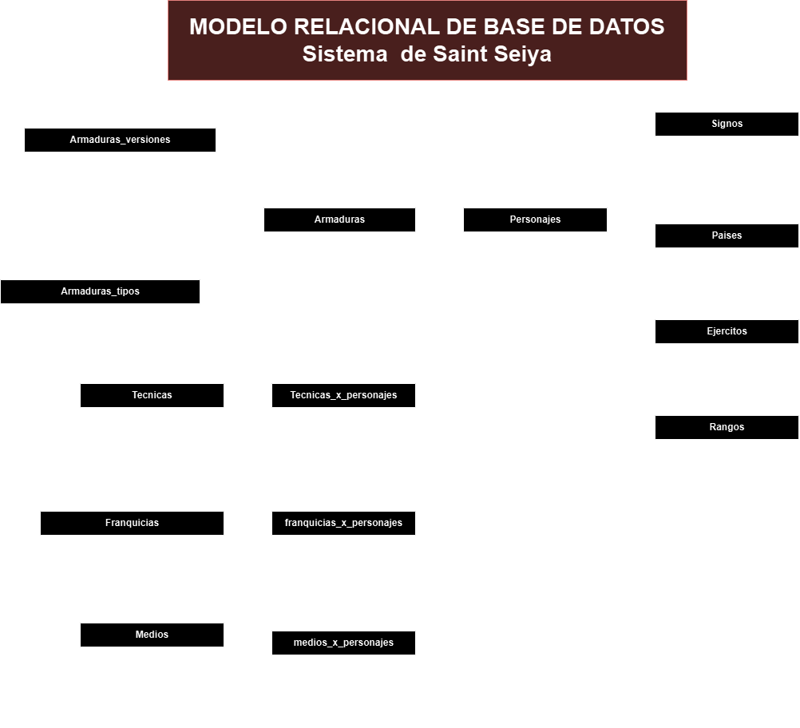

# Sait Seiya

## Listado de entidades

### Personajes **(ED)**

- personaje_id **(PK)**
- nombre
<!-- - armadura **(FK)** -->
- signo_id **(FK)**
- nacimiento
- pais **(FK)**
- entrenamiento **(FK)** (va hacer referencia a la entidad pais 😯)
- maestro **(FK)** (llave foranea de la misma entidad, es como una llave recursiva)
- ejercito **(FK)**
- rango **(FK)**
- foto
- canonico (es escrito y avalado por el autor de la manga {original})

### armaduras **(ED | EC)**

- armadura_id **(PK)**
- armadura
- personaje_id **(FK)**
- armadura_tipo **(FK)**

### armaduras_tipos **(EC)**

- armadura_tipo_id **(PK)**
- armadura_tipo

### armaduras_versiones **(EC | EP)**

- armadura_version_id **(PK)**
- armadura_id **(FK)**
- version
- foto

### signos **(EC)**

- signo_id **(PK)** 
- signo

### paises **(EC)**

- pais_id **(PK)** 
- pais

### ejercitos **(EC)**

- ejercito_id **(PK)** 
- ejercito

### rangos **(EC)**

- rango_id **(PK)** 
- rango

### Tecnicas **(EC)** (va ser una relación de M a M)

- tecnica_id **(PK)** 
- tecnica

### tecnicas_x_personajes **(EP)**

- txp_id **(PK)**
- personaje_id **(FK)**
- tecnica_id **(FK)**

### franquicias **(EC)**

- franquicia_id **(PK)**
- franquicia

### franquicias_x_personajes **(EP)**

- fxp_id **(PK)**
- personaje_id **(FK)**
- franquicia_id **(FK)**

### medios **(EC)** {anime, película, manga, videojuego}

- medio_id **(PK)**
- medio (manga, ánime, videojuego, películas, series)

### medios_x_personajes **(EP)**

- mxp_id **(PK)**
- personaje_id **(FK)**
- medio_id **(FK)**

## Relaciones

1. Un **personaje** tiene muchas armaduras (_1 a M_). 
1. **armadura** tiene un **tipo de armadura** (_M a 1_).
1. Una **"Armadura"** tiene muchas **versiones** (1 a M).
1. Un **signo** pertenece a muchos **personajes** (_1 a M_).
1. Un **pais** pertenece a muchos **personajes** (_1 a M_).
1. Un **personaje** entrenó en un **pais** (_1 a M_)
1. Un **personaje** tiene muchos **maestros** (_1 a M_)
1. **ejercito** tiene muchos **personajes** (_1 a M_).
1. **rango** pertenece a muchos **personajes**(_1 a M_).
1. Un **personaje** tiene muchas **técnicas** y **técnica** puede ser usada por muchos **personajes** (_M a M_). [usamos una tabla pivote]
1. **personaje** tiene muchas **franquicias** y **franquicias** tiene muchos **personajes** (_M a M_).
1. **personajes** pertenece a **medios** y **medios** pertenece a muchos **personajes** (_M a M_).

## Diagrama Modelo Relacional de la BD

## Reglas de Negocio

