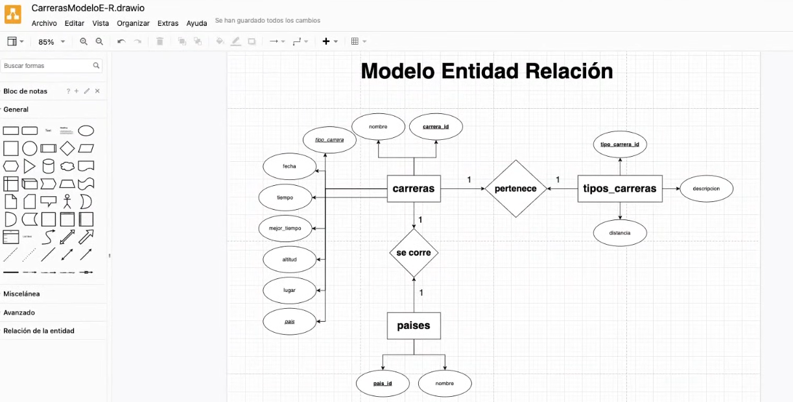
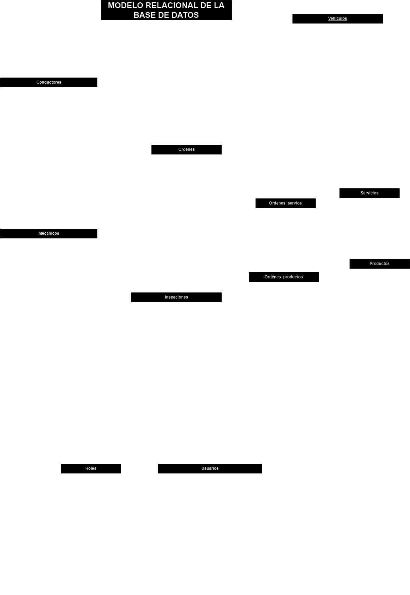

# Area de Mantenimiento del Parque Automotor "A.M.P.A."

## Sistema Integral de Gestión de Taller Mecánico basado en Tecnologías Web

> Debemos estár concientes de los atributos que queremos almacenar de cada entidad

## Listado de entidades:

### CONDUCTORES

- conductor_id **(PK)**
- nombre
- apellidos
- ci
- Calle
- Municipio
- Celular
- email
- categoria_licencia
- dependencia
- Observaciones

### VEHICULOS

- vehiculo_id **(PK)**
- matricula
- clase/tipo (camioneta, sedan) 
- marca    () (Catálogo)
- modelo  () (es una entidad de tipo catálogo)
- año ()
- transmision (automática,sincronica/mecánica)
- dirección (Hidraulica, Mecánica, No disponible, Otro)
- sistema_combustión (Carburado, Inyeccion, No disponible, Otro, Turbo Carburado, Turbo Inyeccion)
- color
- chasis/serial
- combustible (diesel, gas, gasolina, no disponible, otro)
- aceite
- Fecha_creacion/fecha de ingreso
- conductor_id **(FK)**

> el logo cambia segun la marca que estamos escogiendo **marca** y **modelo** son listas

### ORDENES (trabajo o salida)

- orden_id **(PK)**
- fecha_entrada
- fecha_salida (yo doy un estimado, solo cuando se le entrega el impreso va ser con la fecha actual)
- requerimiento(Reparación/Mantenimiento/Ambos)
- descripción
- estado (Pendient, en proceso, finalizado, entregado, cancelado)
- cliente_id **(FK)** (si ya lo tengo solo busco "¿Ya es cliente?")
- vehiculo_id **(FK)** (te pide la placa)
- mecanico_id **(FK)**
- servicio_id **(FK)**
- producto-id **(FK)**      

### INSPECCIONES
- inspeccion_id **(PK)**
- superior
- Parte Delantera
- Lado Derecho
- Lado Izquierdo
- Parte Trasera
- kilometraje
- nivel_combustible
- descripcion general
- observaciones
- inventario_vehiculo( es un checklist: antenas, botiquin, gata, herramientas, extintor)
- foto
- ordene_id **(FK)**

### Productos/repuesto/insumos (catálogo)

- producto_id **(PK)**
- nombre
- cantidad
- categoria(lubricante,repuesto, pieza de recambio) 
 > maneja inventario

### Servicios/mano de obra (catálogo)

- servicio_id **(PK)**
- nombre

> Relaciones

* Órdenes de Trabajo puede tener muchos Servicios y Repuestos.

* Servicios puede pertenecer a muchas Órdenes de Trabajo.

* Repuestos puede pertenecer a muchas Órdenes de Trabajo.

### MECÁNICOS

- mecanico_id **(PK)**
- nombre
- apellidos
- ci
- especialidad
- teléfono
- correo_electronico
- fecha_ingreso
- estado (activo e inactivo)
- direccion
- ciudad
- ocupacion (pintor, lijador, ayudante, mecánico, soldaror...)
- observaciones

### Roles/Administradores? (catálogo)

- rol_id **(PK)**
- nombre
- estado
- fecha_registro

una persona puede tener varior vehiculos, Observa eso. y un vehiculo puede tener varios dueños a lo largo de su vida, pero solo uno.

### Usuarios

- usuario_id **(PK)**
- nombre
- apellidos
- ci
- teléfono
- correo_electronico
- fecha_ingreso
- estado (activo e inactivo)
- direccion
- ciudad
- rol_id **(FK)**

### TALLERES

- taller_id **(PK)**
- nombre-oficial (ampa)
- nombre-comercial (este nombre va salir en las impreciones)
- dirección
- ciudad
- teléfono
- email

## Relaciones

1. Un **Conductor** tiene varios **vehiculos**. (_1 a m_)
1. Un **Vehiculo** pertenece a solo un **conductor**. (_1 a 1_)
1. Un **Vehiculo** puede tener multiples **ordenes** de trabajo. (_1 a m_)
1. Un **Cliente** puede tener multiples **ordenes** de trabajo. (_1 a m_)
1. Un **Mecánico** puede trabajar en multiples **ordenes** de trabajo (_1 a m_)
1. 
 

> CSS utiliza separador medio
> JavaScrip tarbaja con el CamelCase
> PHP trabaja con el snapeCase
> En las bases de datos usaremos _SnepeCase_(la separación por el guin bajo)
> El nombre de las entidades van el plural y los atributos en singular

> **NOTA** parece que ciudad lo debemos separar 

> usa varchar() y no char. por que _char()_ reserva en memoria y varchar() no reserva espacio en memoria "se adapta"

### Modelo Entidad - Relación
 

### Modelo Relacional de la DB

 

## Reglas de Negocio (va ser a nivel semantico)

por cada entidad van a ir describiendo esas reglas de negocio que tenemos que establecer 

### CONDUCTORES

1. Crear el registro de conductore
1. leer el registro de un(os) conductor(res) dada una condición en particular
1. leer todo los registros de la entidad conductores
1. Actualizar los datos de un conductor
1. Eliminar los datos de un conductor dada una condición en particular

### VEHICULOS

1. Crear el registro de vehiculo
1. leer el registro de un(os) vehiculo(s) dada una condición en particular
1. leer todo los registros de la entidad vehiculos
1. Actualizar los datos de un vehiculo
1. Eliminar los datos de un vehiculo dada una condición en particular

### ORDENES 

1. Crear el registro de orden
1. leer el registro de una(s) orden(es) dada una condición en particular
1. leer todo los registros de la entidad ordenes
1. Actualizar los datos de una orden
1. Eliminar los datos de una orden dada una condición en particular

### INSPECCIONES

1. Crear el registro de inspecion
1. leer el registro de una(s) inspeccion(es) dada una condición en particular
1. Eliminar los datos de una inspeccion dada una condición en particular

### Productos

1. Crear el registro de producto
1. leer el registro de un(os) producto(s) dada una condición en particular
1. leer todo los registros de la entidad procuctos
1. Actualizar los datos de un producto
1. Eliminar los datos de un producto dada una condición en particular

### Servicios

1. Crear el registro de servicio
1. leer el registro de un(os) servicio(s) dada una condición en particular
1. leer todo los registros de la entidad servicios
1. Actualizar los datos de un servicio
1. Eliminar los datos de un servicio dada una condición en particular

### MECÁNICOS

1. Crear el registro de mecánico
1. leer el registro de un(os) mecánico(s) dada una condición en particular
1. leer todo los registros de la entidad mecanicos
1. Actualizar los datos de un mecánico
1. Eliminar los datos de un mecánico dada una condición en particular

### Roles

1. Crear el registro de rol
1. leer el registro de un(os) rol(es) dada una condición en particular
1. leer todo los registros de la entidad rol
1. Actualizar los datos de un rol
1. Eliminar los datos de un rol dada una condición en particular

### Usuarios

1. Crear el registro de usuario
1. leer el registro de un(os) usuario(s) dada una condición en particular
1. leer todo los registros de la entidad usuarios
1. Actualizar los datos de un usuario
1. Eliminar los datos de un usuario dada una condición en particular
1. las contraseñas ¿las define el administrador o quien? -ver quien da las contraseñas en youbube-

min 4:15