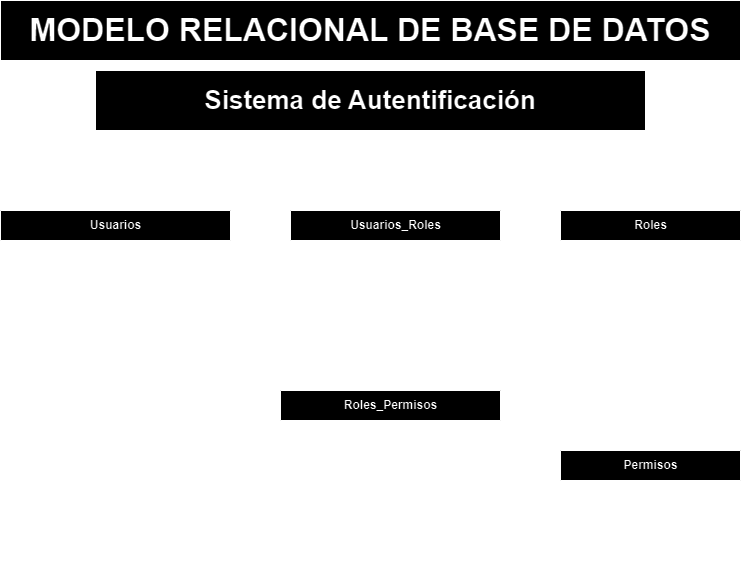

# Sistema de Autenticación

## Listado de entidades

### Usuarios **(ED)**

- usuario_id **(PK)**
- username **(UQ)**
- password
- email  **(UQ)**
- nombre
- apellidos
- avatar
- Estado
- fecha_cración
- fecha_actualizacion

>  - rol_id (fk) aqui estaria limitando al usuario a que pueda elegir uno de todo los que existen.

### Roles **(EC)_entidad catálogo_**

- rol_id **(PK)**
- nombre -> (administrador, editor, superadministrador, suscriptor, escritor, colaborador)
- descripcion

### Permisos **(EC)**

- permiso_id **(PK)**
- nombre
- descripcion

**un usuario puede tener varios roles y un rol pude tener varios usuarios, entonces hay una relación de muchos a muchos entre _Usuarios_ y _Roles_**

### usuarios_roles **(EP)**

- usuario_rol_id **(PK)**
- usuario_id **(FK)**
- rol_id **(FK)**

### Roles_Permisos **(EP)**

- rol_permiso_id **(PK)**
- rol_id **(FK)**
- permiso_id **(FK)**

## Relaciones

Un **usuario** puede terner varios **roles** y un **rol** puede tener varios **usuarios** (_M a M_)
Un **rol** puede terner varios **permisos** y un **permiso** puede tener varios **roles** (_M a M_)

### Modelo Relacional de la BD

## Reglas de Negocio

### usuarios

1. Crear un usuario.
1. leer todo los usuarios (excepto _password_)
1. leer un usuario en particular (excepto _password_)
1. actualizar usuario
1. Validar un usuario.
1. Habilitar un usuario.
1. Inhabilitar un usuario.
1. Actualizar password de un usuario.
1. eliminar usuario

### roles

1. Crear un rol.
1. Leer todo los roles.
1. Leer un rol en particuar.
1. Actualizar un rol.
1. Eliminar un rol.

### permisos

1. Crear un permiso. 
1. Leer todo los permisos.
1. Leer un permiso en particular.
1. Actualizar un permiso.
1. Eliminar un permiso.

### usuario_roles

1. Crear un usuario_rol.
1. Leer todos los usuario_roles.
1. leer un usuario_rol en particular.
1. leer todos los usuario_rol de un usuario.
1. Eliminar un usuario_rol.

### roles_permisos

1. Crear un rol_permiso.
1. Leer todo los rol_permisos.
1. Leer un rol_permiso en particular.
1. leer todos los rol_permiso de un usuario.
1. Eliminar un rol_permiso.
