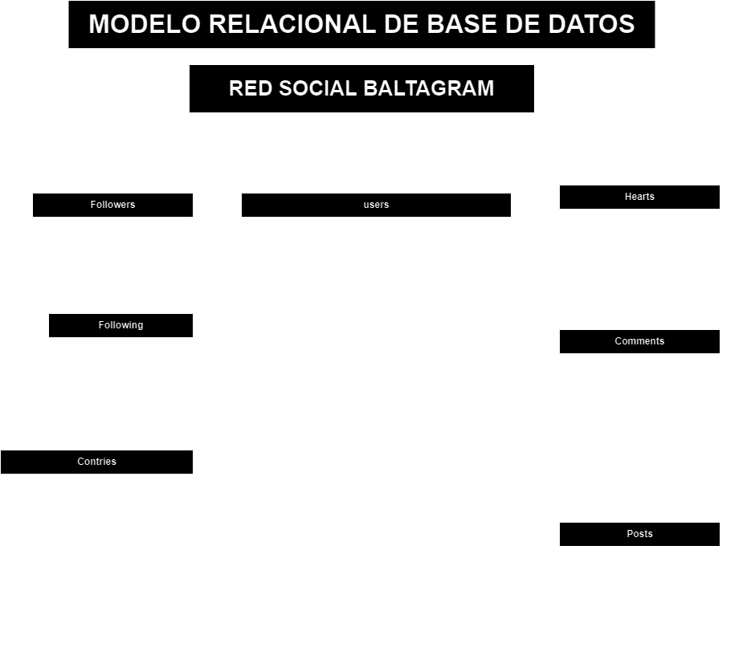

# Baltagram

El objetivo de este proyecto, es una aplicacion que nos permita postear fotografias

## Listado de entidades

### posts **(ED)**

- post_id **(PK)**
- post_date
- plot (es la descripción)
- photo
- user_id **(FK)**

### users **(ED)**

- user_id **(PK)**
- user
- user_date
- user_name
- email **(UQ)**
- password
- phone **(UQ)**
- bio
- web
- avatar
- birthdate
- genre
- country **(FK)**

### comments **(ED | EP)**

- comment_id **(PK)**
- comment_date
- comment
- post_id **(FK)**
- user_id **(FK)**

### hearts **(ED | EP)**

- heart_id **(PK)**
- heart_date
- post_id **(FK)**
- user_id **(FK)**

### following (gerga en instagram, significa siguiento)

- follow_id **(PK)**
- follow_date
- user_id **(FK)**

> - follow_user (es a la cuenta a quien sigo)
### followers (seguidores)

- follower_id **(PK)**
- follower_date
- user_id **(FK)**

### countries **(EC)**
- countrie_id **(PK)**
- country_name

## Relacion Conceptual

Un **usuario** pertenece a un **pais** y un pais tiene varios usuarios (_1 a M_).

Un **usuario** puede publicar varios **posts** y un post solo puede ser publicado por un usuario (_1 a M_).

Un **post** puede tener múltiples **comentarios** (_1 a M_).

Un **usuario** puede hacer múltiples **comentarios** (_1 a M_).

Un **post** puede recibir múltiples corazones (**_hearts_**). Y un corazon pertenece a un solo post (_1 a M_) .

Un **usuario** puede dar múltiples **corazones** un corazon es dado por un solo usuario (_1 a M_)..

Un **usuario** pude seguir a multiples  **usuarios** (_1 a M_).

Un **usuario** puede ser seguido por multiples **usuarios** (_1 a M_).

## Diagramas

### Modelo relacional de la BD

## Reglas de Negocio

### Posts

1. Crear un post.
1. Leer los posts.
1. Leer un post en particular.
1. Leer los post de un user.
1. Actualizar el plot de un post.
1. Eliminar un post.

### users

1. Crear un user.
1. Leer todo los users.
1. Leer un user en particular.
1. Actualizar un user.
1. Validar un user.
1. Actualizar password, user_name, user de un usuario
1. Eliminar un post.

### Comments

1. Crear un comment en un post.
1. Leer todo los comments de un post.
1. Leer un commet de un post.
1. Contar el número de comments de un post.
1. Eliminar un comment.

### Hearts

1. Crear un heart de user en un post.
1. Leer todo los hearts de un post.
1. Leer un heart en particular.
1. Contar el número de hearts de un post.
1. Eliminar heart de user en un post.

### following

1. Crear un following de user.
1. Leer todo los followings de un user.
1. Leer un following de un user en particular. 
1. Contar el número de followings de un user
1. Eliminar un following de un user.

### followers
1. Crear un follower de user.
1. Leer todo los followers de un user.
1. Leer un follower de un user en particular.
1. contar el número de followers de un user
1. Eliminar un follower.

### Contries

1. Crear un contry.
1. Leer todo los contries.
1. Leer un contry en particular.
1. Actualizar un contry.
1. Eliminar un contry.

## MODELO DOCUMENTAL

