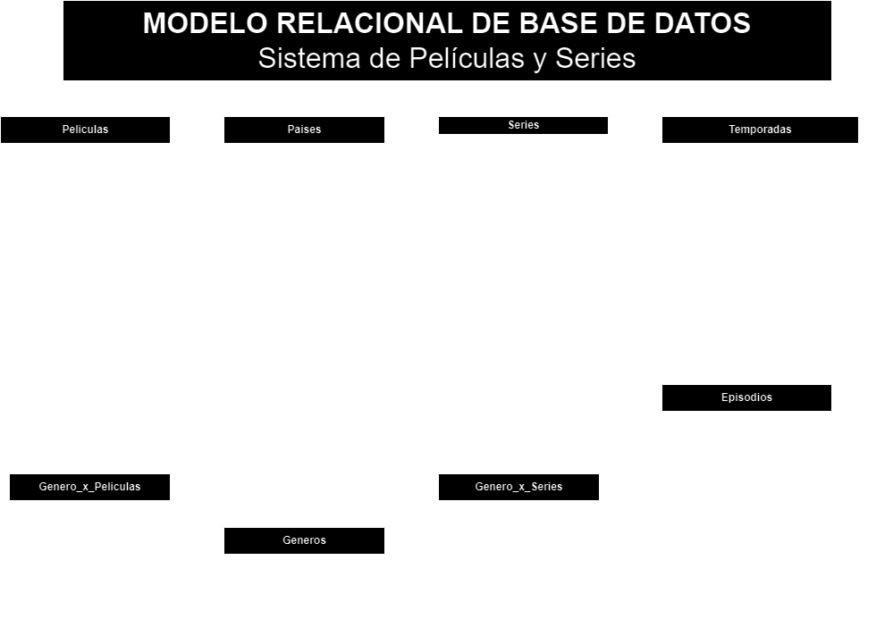

# PeliSeries

## Listado de Entidades

### Peliculas **(ED)**

- pelicula_id **(PK)**
- titulo
- estreno
- duracion
- sinopsis
- estudio
- director
- elenco
- poster
- trailer
- pais **(FK)**

### Series **(ED)**

- serie_id **(PK)**
- titulo
- estreno
- final
- sinopsis
- estudio
- creador
- elenco
- poster
- trailer
- pais **(FK)**

### Temporadas **(ED)**

- temporada_id **(PK)**
- serie_id **(FK)**
- numero
- estreno
- titulo
- sinopsis
- poster
- trailes

### Episodios **(ED)**

- episodio_id **(PK)**
- temporada_id **(FK)**
- numero
- estreno
- titulo
- sinopsis
- director
- duracion

### Paises **(ED)**

- pais_id **(PK)**
- nombre

### Generos **(EC)**

- genero_id **(PK)**
- nombre

### Generos_x_peliculas **(EP)**

- gxp_id **(PK)**
- pelicula_id **(FK)**
- genero_id **(FK)**

### Generos_x_series **(EP)**

- gxs_id **(PK)**
- serie_id **(FK)**
- genero_id **(FK)**

## Relaciones conceptuales

- Una **película** pertenece a un **pais** (_1 a 1_).
- Una **serie** pertenece a un **pais** (_1 a 1_).
- Una **pelicula** tiene muchos **géneros** y un **género** pertence a muchas **películas** (_M a M_).
- Una **serie** tiene varias **temporadas** (_1 a M_).
- Una **temporada** tiene varios **episodios** (_1 a M_).
- Una **serie** tiene muchos **géneros** y un **género** pertence a muchas **series** (_M a M_).

## Diagramas

### Modelo relacional de la BD

## Reglas de Negocio

### Peliculas

1. Crear una película.
1. Leer toda las películas.
1. Leer una película en particular.
1. Actualizar una película.
1. Eliminar una película.

### Series

1. Crear una serie.
1. Leer toda las series.
1. Leer una serie en particular.
1. Actualizar una serie.
1. Eliminar una serie.
1. Leer las temporadas de una serie.
1. leer los episodios de una serie.

### Temporadas

1. Crear una temporada.
1. Leer toda las temporadas de una serie.
1. Leer una temporada en particular.
1. leer los episodios de una temporada.
1. Actualizar una temporada.
1. Eliminar una temporada.

### Episodios

1. Crear un episodio.
1. Leer todo los episodios de una temporada.
1. Leer un episodio en particular.
1. Actualizar un episodio.
1. Eliminar un episodio.

### Paises

1. Crear un pais.
1. Leer todo los paises.
1. Leer un pais en particular.
1. Actualizar un pais.
1. Eliminar un pais.

### Generos

1. Crear un genero.
1. Leer todo los generos.
1. Leer un genero en particular.
1. Actualizar un genero.
1. Eliminar un genero.

> estas de abajo no tiene sentido actualizarlas; son pk.

### Generos_x_peliculas

1. Crear el registro genero por película.
1. Leer todo los generos de una película.
1. Elimiar un genero_x_película.

### Generos_x_series

1. Crear el registro genero por serie.
1. Leer todo los generos de una serie.
1. Elimiar un genero_x_serie.

