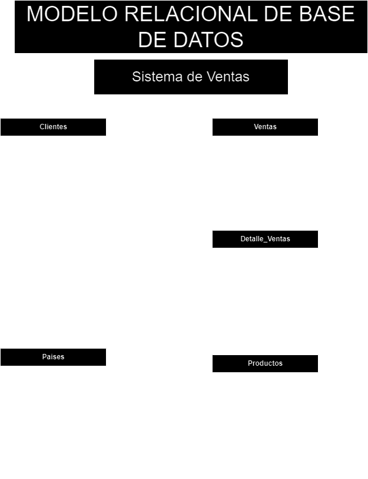

# VENTAS

## Listado de entidades

### Clientes  **(ED) entidad de datos**
- cliente_id **PK**
- nombre
- apellidos
- telefono **(UQ)**
- email **(UQ)**
- dirección
- municipio
- ciudad
- pais_id **(FK)** 

### Productos  **(ED/|EC)**
- producto_id **PK**
- nombre
- descripcion
- foto
- precio
- stock  _me refiero al stock_

### Ventas **(ED)**
- venta_id **(PK)**
- fecha 
- monto
- cliente_id **(FK)**

### Detalle_ventas **(EP)**
- detalle_id **(PK)**
- cantidad
- precio_unitario
- venta_id **(FK)**
- producto_id **(FK)**

### Paises **(Entidad Catálogo EC)**

- pais_id **(PK)**
- nombre
- dominio **(UQ)**

> si tu vendes ropa tendrás que agregar 'tallas' entonces si vendes otros productos tendras que identificar sus atributos.

## Relaciones   

> Miremos siempre desde la perspectiva del cliente y no desde la perspectiva del pais.

1. Un **cliente** pertenece a un **pais** (_1 a 1_)
1. Un **cliente** genera muchas **ventas**  (_1 a m_)
1. Una **venta** tiene **detalle_ventas** (_1 a m_)
1. un **detalle_venta** es un **produto** (_1 a 1_)
1. 
1. 

### MODELO RELACIONAL DE LA BASE DE DATOS: SISTEMA DE VENTAS

